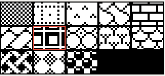
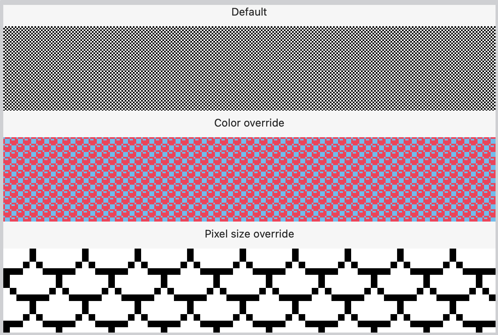
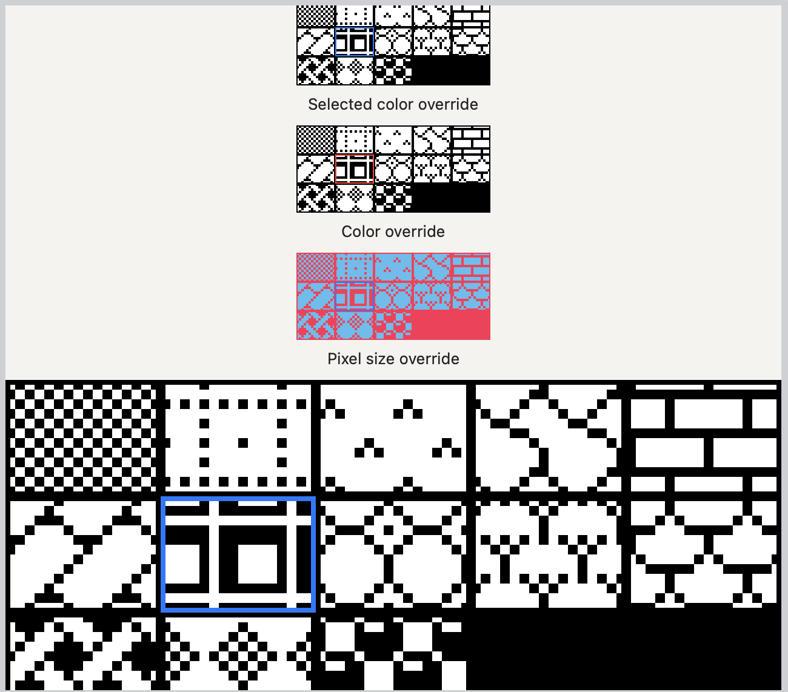
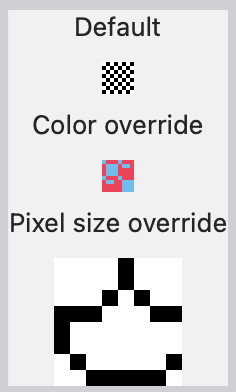

# Patterns

SwiftUI tiling black and white patterns.

This project contains `PatternView`, which is built out of `Tiles` with a given
`TileDesign`.

It also includes a `TilePicker` that can be used to control the selected
design.

## Available Tile Designs

The `TileDesign` enum contains the following patterns (shown in the image from
top left to bottom right)



* `.grid`
* `.dottedGrid`
* `.stitch`
* `.curvedTile`
* `.brick`
* `.tile`
* `.shadowGrid`
* `.circles`
* `.trees`
* `.shingles`
* `.wicker`
* `.rhombus`
* `.balls`

## Usage

The `PatternView` view will tile the selected design in its frame. It has the
following properties:

* `design: Binding<TileDesign>`: **required**, which design to use to tile the
  frame.
* `pixelSize: CGFloat`: **defaults to 2.0**, the size of a pixel in the tile.
* `foregroundColor: Color`: **defaults to `Color.black`**, the foreground color.
* `backgroundColor: Color`: **defaults to `Color.white`**, the background color.

```
// PatternView using default settings
PatternView(design: .constant(TileDesign.shadowGrid))

// PatternView using overrides
PatternView(design: $tileDesign, pixelSize: 4.0, foregroundColor: .pink, backgroundColor: .cyan)
```

### Screenshots of the Patterns



## Using the PatternPicker

The pattern picker view is intended to be used when you want to allow users to
change the design of the pattern.

* `selectedDesign: Binding<TileDesign>`: **required**, the current selected
  tile design.
* `selectedColor: Color`: **defaults to `Color.accentColor`**, the color of the
  border around the selected tile design.

It also has `pixelSize`, `foregroundColor`, and `backgroundColor` with the
same effect as `Pattern` mentioned above


```
@State var design: TileDesign = .brick
@State var shouldShowPatternPicker = false

...

PatternView(design: $pattern)
  .frame(width: 32.0).border(.black)
  .onTapGesture {
    shouldShowPatternPicker = !shouldShowPatternPicker;
  }
  .popover(isPresented: $shouldShowPatternPicker) {
    PatternPicker(selectedDesign: $design)
  }
  .onChange(of: pattern) { _ in
    shouldShowPatternPicker = false;
  }
```

### Screenshots of the Pattern Picker



## Supported Platforms

* macOS 12+
* iOS 15+
* tvOS ?+
* watchOS 8+
* catalyst 15+

## The Tile view

If you'd like to do other things with the individual tiles, we also provide the
Tile view, which is just a single tile.

The tiles support the same properties as `PatternView` with the exception that
`design` is a `TileDesign` and not a `Binding<TileDesign>`


